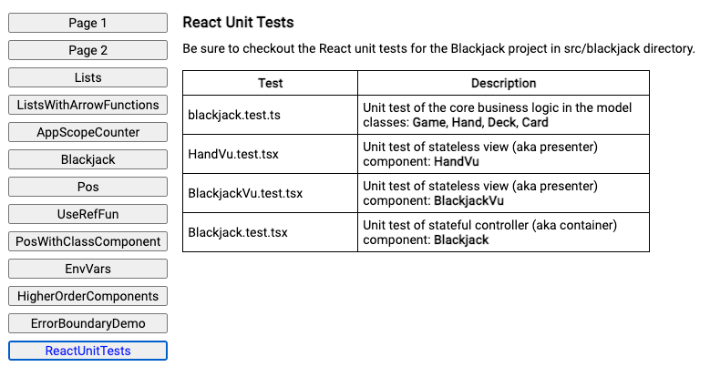

# React Workshop for Cisco

## If you left early
We added some cool stuff near the end:

* Full routing with URL and back button support.
* Recreated the Pos page as a class-based component.
* Error Boundaries
* useRef hook
* CRA's Environment Variable feature
* Higher Order Components
* React UI Unit Tests (finally finished/fixed these)
* Cleaned up some ad hoc examples and added them to the App1 menu (had to go vertical)

## To run the final projects on your computer

    To run the server:
        git clone https://github.com/StokeMasterJack/api1
        cd api1
        npm install
        node index.js
    
    To run the client:
        git clone https://github.com/StokeMasterJack/app1
        cd app1
        npm install
        npm start

